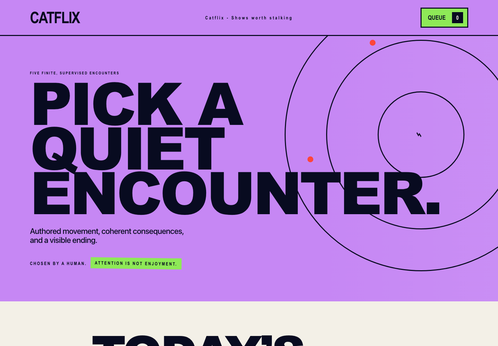

# Catflix

Catflix is a local-first catalogue of five finite, supervised visual encounters for cats. It combines an editorial watchlist, explicit setup checks, deterministic interactive scenes, descriptive observation notes, and a research record that separates observable attention from claims about enjoyment or welfare.



## Alpha status

This public repository is a source alpha, not a tagged release. The application and its automated checks run locally, its dependency graph is locked, and its runtime artwork has independent project-generation provenance. A versioned alpha release still requires a green workflow for the exact release commit. See [RELEASE_STATUS.md](RELEASE_STATUS.md) for the current evidence and remaining release work.

## What works

- Five authored scenes with finite durations and visible endings
- Tablet-touch and passive television playback modes
- Mandatory device, cable, exit, and supervision checks before playback
- Local queue, progress, settings, observations, matched comparisons, import, and export
- Theme, subject, and motion filters with recoverable empty states
- Standard and low scene-motion settings independent of operating-system reduced motion
- A 60-source research baseline with a source-level evidence ledger
- Keyboard-operable dialogs, focus restoration, and responsive layouts

Catflix does not rank cats, infer preferences automatically, diagnose health, claim therapeutic benefit, or treat attention as enjoyment. Playback starts muted, never auto-replays, and never starts from the queue without an owner action.

## Run locally

Requirements: Node.js `^20.19.0` or `>=22.12.0` and npm.

```bash
npm ci --ignore-scripts
npm run dev
```

Open the URL printed by Vite. All application records remain in the browser's local storage layer. No runtime network request is required for the catalogue, playback, or local record workflow. External DOI links in the research view require network access when opened.

## Verify

```bash
npm run check
```

`npm run check` runs the focused unit suite, TypeScript compilation, and the production build. The GitHub Pages deployment is built from the same application with a `/catflix/` base path.

## Screenshots

The checked-in images are static documentation assets. See [docs/SCREENSHOTS.md](docs/SCREENSHOTS.md) for the gallery.

## Project map

- `src/App.tsx`: catalogue and local workflow orchestration
- `src/content/registry.ts`: five-scene content, provenance, and safety metadata
- `src/simulation/`: deterministic encounter definitions and Phaser host
- `src/storage/`: IndexedDB-backed local records with an in-memory fallback
- `docs/research/`: maintained scientific baseline and source ledger
- `assets/masters/`: source artwork and its generation record retained for provenance and future mastering
- `public/assets/`: browser-delivery artwork

## Research and safety

The [scientific foundation](docs/research/feline-perception.md) is the maintained interpretation of the evidence. The [evidence ledger](docs/research/evidence-ledger.csv) records the 60 peer-reviewed sources. Product and curator copy must preserve the distinction between sensory capacity, attention, voluntary preference, and welfare.

Keep the device stable, protect cables, leave an unobstructed exit, supervise continuously, and stop after collision, repeated hard strikes, marked startle, freezing, hiding, distressed vocalization, redirected aggression, persistent behind-screen searching, loss of balance, or behavior the observer considers abnormal.

## Contributing and security

Read [CONTRIBUTING.md](CONTRIBUTING.md) before proposing changes. Report security or privacy concerns using [SECURITY.md](SECURITY.md).

## License

Catflix software and original project documentation are available under the [MIT License](LICENSE). Bundled project-generated assets retain the terms and provenance recorded in the content registry; see [NOTICE.md](NOTICE.md).
