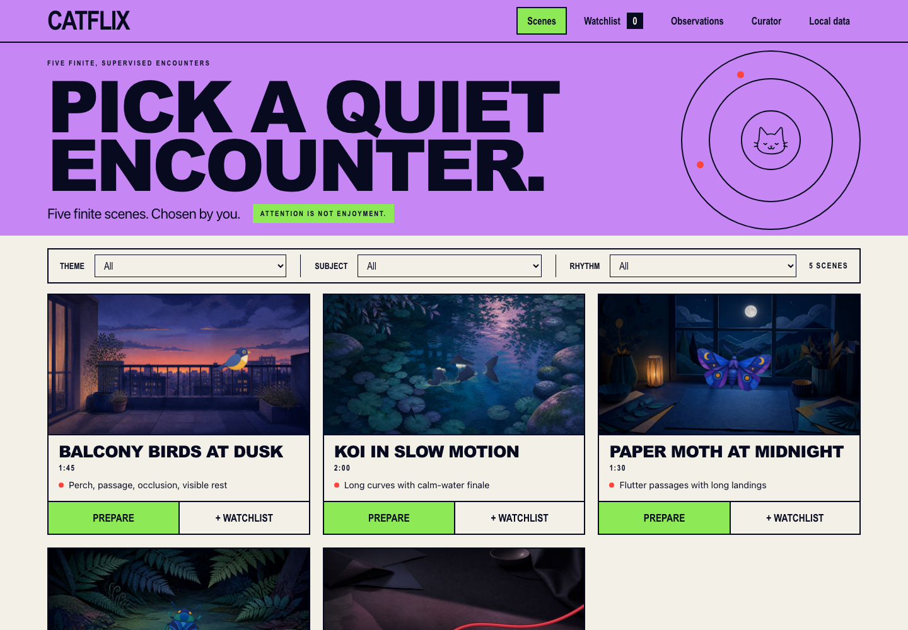
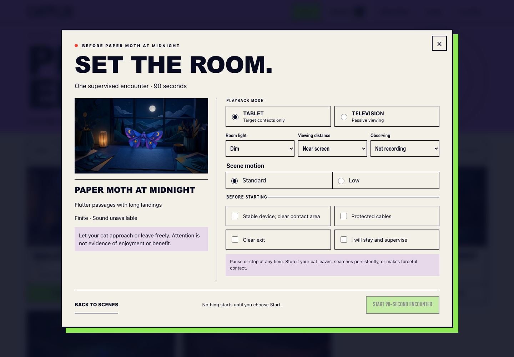
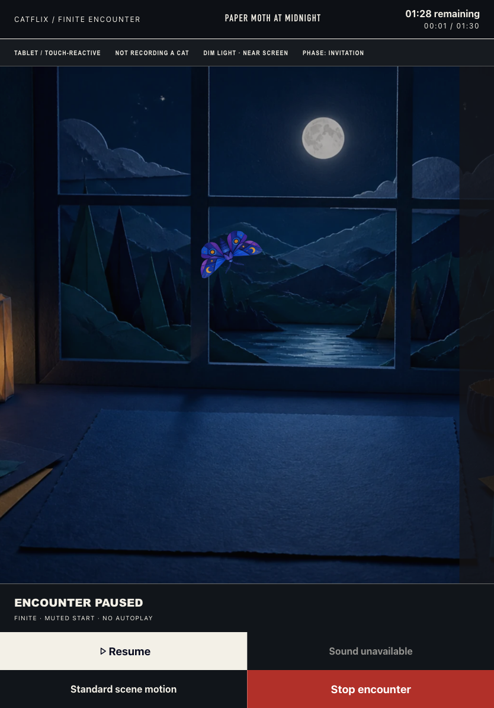
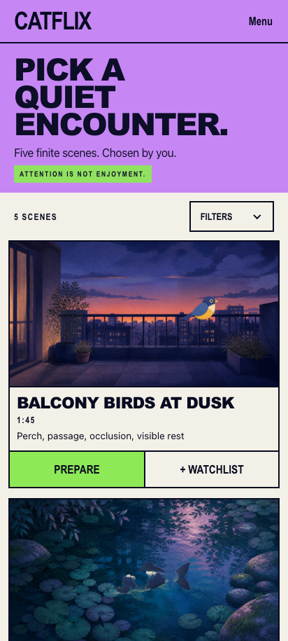

# Catflix

[](https://github.com/sebastianspicker/catflix/actions/workflows/ci.yml)
[](LICENSE)


**A local-first browser catalogue of five finite, supervised scenes for
cats.** *Local-first* means everything runs and stays in your own browser —
there is no server storing your data.

[**Open the live demo →**](https://sebastianspicker.github.io/catflix/) ·
[**See the screenshot tour →**](https://sebastianspicker.github.io/catflix/demo)

## In brief

Catflix takes the shape of a streaming service and points it at a small,
hand-built watchlist made for cats. You pick a scene, confirm the room is
safe, and start a short "encounter" — a single timed viewing session — that
begins muted, ends on its own, and never replays itself. Everything runs in
one browser tab: no account, server, analytics, or network dependency of any
kind [README, Intro paragraphs].

The project is also a working example of a few things done carefully:
**deterministic**, frame-accurate simulation (deterministic means the same
inputs — including the numeric **seed** that starts a scene — always produce
the same scene, run after run); strict internal module
boundaries that are checked automatically in continuous integration (**CI**
— the automated pipeline that runs checks on every change); and private,
versioned local data with a real upgrade path between data formats [README,
Intro paragraphs].

**Status: source alpha.** No version has been tagged for release yet
[README, Status]. If you are trying to decide whether to use it: it works
today, in any modern desktop or tablet browser, but treat it as an
early-stage, actively developed project rather than a finished product.

## The five scenes

| Scene | Length | Note |
| --- | --- | --- |
| Balcony Birds at Dusk | 1:45 | Perch, passage, occlusion, visible rest |
| Koi in Slow Motion | 2:00 | Long curves with a calm-water finale |
| Paper Moth at Midnight | 1:30 | Flutter passages with long landings |
| Beetle Beneath the Fern | — | Fern-margin crossings and shelter |
| The Red String Incident | — | Bounded tension and slack passages |

A dash ("—") in the Length column means the source catalogue does not list a
length for that scene — it is not zero or unknown-but-omitted-here; the
project itself has not published one. [README, Scene table]

Each scene is a finite, supervised encounter, not a loop: it plays through
once and stops. For the reasoning behind that design — and why Catflix
avoids claiming cats "enjoy" any particular scene — see [Catflix product
principles](PRODUCT.md).

## A quick look

The same tour is browsable at
[`/demo`](https://sebastianspicker.github.io/catflix/demo) on the live site,
or run it locally with `npm run dev` and open `/demo`.

### 1. Browse the catalogue



Five finite encounters with theme, subject, and rhythm filters, a local
watchlist, and a curator note for each scene.

### 2. Set the room



Playback stays locked until you choose a screen context and confirm a stable
device, protected cables, a clear exit, and continuous supervision — the
safety checklist described in [Catflix product
principles](PRODUCT.md#safety).

### 3. Watch together



The player starts muted and keeps owner controls outside the scene itself,
with pause, stop, and a scene-motion setting.

### 4. Take it anywhere



The same catalogue at a 412 × 915 **viewport** (the visible screen area a
page is laid out for, in pixels) — no separate mobile app.

## Your data stays with you

Every record Catflix keeps — your watchlist, progress, notes, observations,
and comparisons — lives only in your browser, in a local database called
**IndexedDB** (a storage system built into modern browsers). Nothing is
uploaded anywhere [README, Local data and privacy].

Specifically:

- Catflix uses one IndexedDB database, `catflix-local`, currently at **data
  format version 2** (also called *schema version 2*: the shape and rules
  the stored records follow). It has seven stores (categories of records):
  settings, queue, progress, notes, observations, comparisons, and
  provenance (asset origin records).
- **Import** accepts a backup file in data format version 1 or 2, after
  showing you a validated preview. Confirming the import atomically (all at
  once, or not at all) replaces every one of the seven stores. **Export**
  always writes data format version 2.
- A backup must fit in **5 MiB** (mebibytes — a mebibyte is about 1.05
  million bytes, slightly larger than a "megabyte") of UTF-8, human-readable
  JSON. Within that limit, each store has its own count limit: **1** settings
  record, **5** queue items, **5** progress records, **10,000 each** of
  notes, observations, and comparisons, and **100** provenance records.
- If IndexedDB can't open on your device or browser, Catflix reports
  **temporary-memory mode** (also called *degraded mode*): it keeps working
  for the current page visit only, using memory instead of durable storage.
  Import and export are disabled in that mode, so temporary data can never
  be mistaken for a saved backup.
- Existing records that are larger than the normal limits are never
  truncated or silently dropped. A separate **"recover an oversized
  record"** action downloads a distinct recovery copy before you delete
  anything.
- Exports can contain the free-form household notes you wrote, so treat
  exported files as private data — the same way you would treat a personal
  diary export.

## What the observations mean

Catflix records what a cat does — looking, tracking, approaching, and
pouncing — and calls that **attention**. It never records or implies
**enjoyment**, **preference** (a voluntary choice between options), a
**diagnosis**, or **welfare** (how a cat fares over time, beyond one moment)
[README, Local data and privacy]. This distinction is not a technical
footnote: it is a core product rule, explained fully in [Catflix product
principles](PRODUCT.md#the-scientific-boundary).

## Run it yourself

Use the Node.js version listed in [`.nvmrc`](.nvmrc) (Node 24) and npm:

```bash
npm ci --ignore-scripts
npm run dev
```

Vite (the build tool Catflix uses) prints the local URL, usually
`127.0.0.1:4173`. The app needs no API keys or environment variables.
Research citations only reach the network if you click their external links
yourself.

**Stack:** React 19 and TypeScript, built with Vite, with a Canvas renderer
(the browser's 2D drawing surface) that lazily upgrades to **Phaser** (a
JavaScript game-rendering library, loaded only when needed) for richer scene
rendering. IndexedDB handles all local storage. There is no backend server.

## For developers

### Commands

| Command | Purpose |
| --- | --- |
| `npm run dev` | Start the Vite dev server. |
| `npm run test` | Run the colocated Vitest test suite once (tests kept beside the code they check). |
| `npm run test:watch` | Run the test suite in watch mode, re-running on file changes. |
| `npm run test:build` | Run build-manifest and CI artifact fixtures. |
| `npm run test:e2e` | Build and preview the Pages artifact, then run end-to-end (**e2e**: tests that drive a real browser through the whole app, not just one function) checks on desktop Chromium and iPad WebKit. |
| `npm run lint` / `npm run lint:fix` | Check code and style rules with ESLint and Stylelint (**lint**: automated style and mistake checking), or apply the fixes that are safe to apply automatically. |
| `npm run quality:size` / `npm run quality:duplication` | Check source-file size and code-duplication limits. |
| `npm run typecheck` | Type-check the app and the Vite configuration. |
| `npm run build` | Type-check and build the production files into `dist/`. |
| `npm run verify` | Run the full core gate: lint, size/duplication, unit and artifact tests, the architecture checker, the build, and the bundle budgets (see below). |
| `npm run build:pages` | Build and validate the `/catflix/` GitHub Pages artifact. |
| `npm run preview:pages` | Preview an existing Pages build at `127.0.0.1:4174`. |

`npm run verify` is the fast core gate that must pass locally. `npm run
test:e2e` is a separate, slower browser gate that CI runs after it. There is
no standalone code-formatting or coverage-percentage command.

### Project layout

| Path | Responsibility |
| --- | --- |
| `src/domain/` | Stable scene, playback, and encounter vocabulary shared across the app. |
| `src/catalogue/model/` | The five authored scenes, their provenance, validation, and derived data. |
| `src/catalogue/ui/` | Catalogue and local-data presentation. |
| `src/encounter/engine/` | The deterministic, browser-independent encounter simulation. |
| `src/encounter/runtime/` | Browser lifecycle, Canvas rendering, the optional lazy Phaser upgrade, pointer handling, and synthesized Web Audio playback. |
| `src/encounter/ui/` | Safety setup, player controls, curation, and observation forms. |
| `src/local-data/` | Versioned codecs (encode/decode logic), IndexedDB access, temporary-memory fallback, and repository operations. |
| `src/demo/` | The `/demo` screenshot tour. |
| `src/app/`, `src/App.tsx` | Workflow state and application composition. |
| `src/research/`, `src/ui/`, `src/styles/` | The research route, shared UI primitives, and styling. |
| `assets/masters/`, `public/assets/` | Source artwork and provenance records, and browser-delivery assets. |

*Note:* this table describes `src/encounter/runtime/` using [docs/ARCHITECTURE.md](docs/ARCHITECTURE.md)'s
fuller wording, which includes synthesized Web Audio playback. An earlier
version of this table omitted audio from that row; the two source documents
had drifted apart on this point, and this rewrite follows ARCHITECTURE.md.

See [How Catflix is built](docs/ARCHITECTURE.md) for dependency direction,
runtime and data flow, stable contracts, and where new code belongs.

### Quality checks and bundle budget

The **bundle budget** check follows Vite's build manifest (a file listing
every built asset and its dependencies) and holds the initial JavaScript
sent to the browser — everything statically imported or preloaded, counted
once — to **300 KiB** (kibibytes — a kibibyte is 1,024 bytes, slightly
larger than a "kilobyte"). Phaser must stay reachable only through a dynamic
(on-demand) import, outside that initial 300 KiB graph, and no larger than
**1,500 KiB** itself. Both the root build and the `/catflix/` Pages build are
checked. [README, Documentation]

### Continuous integration (CI)

CI runs the fast core gate first, then runs the Playwright end-to-end suite
against the built Pages artifact, and uploads that already-tested build. A
separate `pages` job validates the uploaded artifact without rebuilding it,
and a `deploy` job publishes that same artifact on pushes to `main`
([workflow definition](.github/workflows/ci.yml)). The iPad WebKit test
project is browser **emulation** of an iPad, run on a desktop machine — it
is not validation on a physical iPad. [README, Documentation]

## Further reading

- [Catflix product principles](PRODUCT.md) — voice, curation limits, and
  safety rules.
- [How Catflix is built](docs/ARCHITECTURE.md) — module boundaries and data
  flow.
- [Contributing](CONTRIBUTING.md) — workflow and review expectations.
- [What the science says about cats and screens](docs/research/feline-perception.md)
  and the [evidence ledger](docs/research/evidence-ledger.csv) — the
  research sources behind Catflix's rules.
- [Screenshots](docs/SCREENSHOTS.md) — the checked-in surface gallery.
- [Security policy](SECURITY.md) — how private local records and security
  reports are handled.
- [Asset notice](NOTICE.md) and [visual asset provenance](assets/masters/PROVENANCE.md)
  — the boundary between the MIT-licensed code and the separately licensed
  visual assets.

## License

Catflix's software and original project documentation are available under
the [MIT License](LICENSE). The license does not grant rights in the
bundled visual assets; see [NOTICE.md](NOTICE.md).

## Glossary

- **Attention** — a cat looking at, orienting toward, tracking, or
  approaching something; not the same as enjoyment or preference.
- **Bundle budget** — the size limit Catflix enforces on the JavaScript sent
  to the browser on first load.
- **CI (continuous integration)** — the automated pipeline that runs checks
  (tests, lint, build) on every change.
- **Degraded mode / temporary-memory mode** — a fallback where Catflix runs
  from in-page memory instead of IndexedDB, because IndexedDB could not
  open; import and export are disabled in this mode.
- **Deterministic** — producing the same output from the same input, every
  time; used here for the encounter simulation.
- **e2e (end-to-end) tests** — automated tests that drive a real browser
  through a full workflow, not just one function.
- **IndexedDB** — a database built into modern web browsers, used here to
  store all of Catflix's local records.
- **KiB / MiB (kibibyte / mebibyte)** — binary units of digital size:
  1 KiB = 1,024 bytes; 1 MiB ≈ 1.05 million bytes. Slightly larger than the
  more familiar "kilobyte" and "megabyte."
- **Lint** — automated checking for style and likely mistakes in code.
- **Local-first** — an app design where data is created, stored, and used
  primarily on the user's own device, not on a remote server.
- **Phaser** — a JavaScript library Catflix optionally loads to render
  scenes with richer effects than the base Canvas renderer.
- **Preference** — a voluntary choice between two or more available
  options; distinct from simply watching or attending to one thing.
- **Schema version** — the version number of the data format a stored
  record follows; Catflix's current format is version 2.
- **Seed** — a starting value that makes a deterministic simulation
  reproducible: the same seed always produces the same scene.
- **Vite** — the build tool Catflix uses for local development and
  production builds.
- **Viewport** — the visible area of a page in a browser window or device
  screen, measured in pixels.
- **Welfare** — how a cat fares over time, beyond a single moment of
  attention; positive, neutral, stressful, or physically risky.
