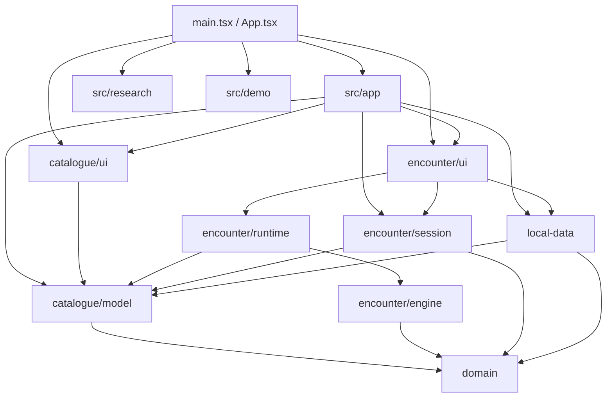
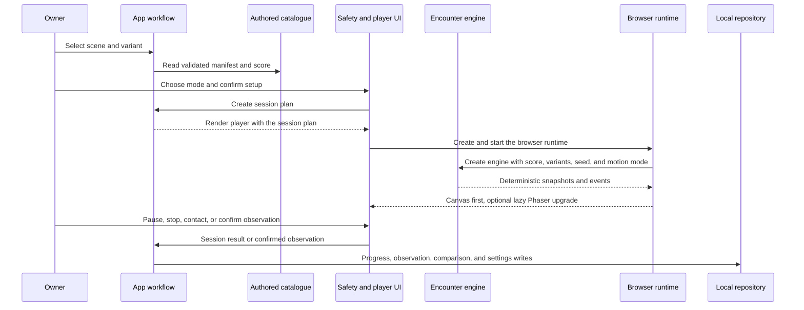

# Architecture

Catflix is a modular, local-first React app. One browser tab shows a catalogue of
five authored encounters, walks the owner through a safety setup, runs a
deterministic finite simulation, and keeps descriptive records on the device.
There's no backend, account, API, analytics, cloud sync, or catalogue service to
call.

## System context

The browser app is the only runtime. IndexedDB and the bundled assets are local
browser dependencies. External research links are navigation targets, not data
sources. GitHub Actions is the only deployment path.

## Components

| Component | Responsibility | Boundary |
| --- | --- | --- |
| `src/domain/` | Stable scene, variant, playback, setup, and simulation contracts | Pure lowest-level vocabulary; imports no product module |
| `src/catalogue/model/` | Five authored scene aggregates, validation, provenance, manifests, and scene-score projections | Pure content source of truth; depends on `domain` |
| `src/encounter/engine/` | Seeded actor state, timing, motion, contact policy, rest windows, events, and completion | Pure simulation; depends on `domain` |
| `src/encounter/session.ts` | Converts a selected manifest and setup into a session plan | Depends on `domain` and catalogue model |
| `src/encounter/runtime/` | Browser lifecycle, Canvas renderer, lazy Phaser renderer, visibility, pointers, and eligible audio playback | Browser adapter over the engine and catalogue runtime inputs |
| `src/encounter/ui/` | Safety gate, player shell, owner controls, curator, and observation forms | React presentation and encounter orchestration |
| `src/local-data/` | Versioned records, validation, IndexedDB, degraded memory, import/export, and repository operations | Only persistence boundary |
| `src/catalogue/ui/` | Catalogue, filters, queue, evidence summaries, and local-data controls | Renders supplied application state; owns no workflow or persistence |
| `src/research/` | `/research` route and safe Markdown presentation | Loads the maintained research Markdown at build time |
| `src/demo/` | `/demo` screenshot tour of the shipped surfaces | Reads checked-in screenshots and `paths`; owns no product rules |
| `src/ui/`, `src/styles/` | Shared presentation primitives and global/feature CSS | No product rules |
| `src/app/`, `src/App.tsx`, `src/main.tsx` | Workflow state, module composition, route selection, and lazy screen loading | Application integration only |

The principal import direction:

The diagram shows the main edges, not every allowed UI import.
`scripts/check-architecture.mjs` is the authority: it classifies every TypeScript
module, rejects forbidden relative imports and removed legacy paths, and reports
dependency cycles.

## Encounter flow

The authored scene aggregate is the single content source. It projects to a
validated public manifest and a deterministic scene score. The engine owns
simulation truth; Canvas and Phaser render the same snapshots. Canvas starts
synchronously and stays the fallback if Phaser can't load. Passive television
mode rejects contact input in both the runtime and the engine.

Progress callbacks already carry the computed phase, so the player keeps precise
elapsed time in a ref and updates React only when the displayed second or phase
changes. Pausing cancels Canvas scheduling; an explicit resume starts one loop
from a fresh time baseline. Phaser can finish loading while paused and stays
paused. A visible tab never resumes playback automatically.

Sessions are finite. Three accepted target contacts within 20 seconds open a
10-to-12-second quiet rest window. Contact responses never add speed, actors,
sound, contrast, or duration. Playback begins muted, and audio events play only
when a matching local provenance record is eligible. No current record is.

## Local data

`src/local-data/` owns the IndexedDB database `catflix-local` (version 2) with
stores `settings`, `queue`, `progress`, `notes`, `observations`, `comparisons`,
and `provenance`. The application composition layer creates the repository once.

Export emits schema v2. Import accepts v1 and v2, validates record shape, bounded
store and text sizes, unique keys, and linked-record consistency, normalizes v1
settings, and supplies an empty observations store for v1 data. The app prepares
a metadata/count preview first; only explicit confirmation replaces all seven
stores in one transaction. If IndexedDB can't open, the adapter reports degraded
mode and uses page-lifetime memory, where import and export stay disabled so
temporary data can't look durable.

After a record mutation, the repository returns a `LocalRecordHistory`, so React
state reflects committed notes, observations, and comparisons instead of
incremented counters. The transaction adapter stages a per-store key change log
and commits only the final `put`/`delete` operations; full-store clears and
replacement are reserved for imports. Admission reads a snapshot inside the same
all-store readwrite transaction, so overlapping tabs serialize their capacity
checks. Startup provenance is admitted as one batch. Observation save and
compatible-comparison creation share one multi-store transaction, and so does
exact note, observation, and comparison deletion. Deleting an observation removes
its links from retained comparisons and writes only the comparisons whose links
changed; deleting a comparison keeps both observations.

`localDataCapacity.ts` centralizes a 5 MiB byte limit and per-store counts: one
settings record, five queue items, five progress records, 10,000 each of notes,
observations, and comparisons, and 100 provenance records. UTF-8 byte measurement
uses the same pretty-printed schema-v2 serialization as downloads. Both the
uploaded file size and the normalized v1/v2 export size are checked. Pairs of
observations and comparisons that would exceed capacity are rejected atomically
before any write.

Capacity errors are typed, and they don't signal degraded IndexedDB. Observation
drafts stay open, and background persistence failures raise an application alert.
Existing over-limit data stays intact: deletion and non-growing updates are
allowed, additions are blocked. Normal export passes import validation; explicit
recovery export preserves oversized data under a distinct filename with a notice
that it exceeds normal import limits. No recovery path truncates data.

Earlier progress is a restart reminder, not timeline resume. Contrast and motion
observations pair only when the canonical A/B variants and the scene, content
revision, seed, authored score, and dimension all agree. Pairing picks the oldest
unused compatible observation and never overwrites a side or infers a winner.
Imported historical records may keep sound or novelty dimensions for schema
compatibility, but those are display-only for automatic pairing.

## Routes and runtime controls

`src/main.tsx` selects the catalogue route `/`, the lazily loaded research route
`/research`, or the lazily loaded `/demo` screenshot tour. `src/paths.ts` resolves
each against Vite's base URL, including the deployed `/catflix/` prefix.

Supported query controls:

- `seed=<positive-integer>` for deterministic encounter selection;
- `contrast=enhanced` to start the enhanced figure-ground variant;
- `renderer=canvas` to keep the Canvas renderer instead of upgrading to Phaser.

Other renderer values use the normal Canvas-first, lazy-Phaser path.

## Build and deployment

The repository is one private npm package. `npm run verify` runs ESLint and
Stylelint, the source-size and duplication gates, Vitest, the Node artifact/CI
fixtures, the architecture validator, the TypeScript and Vite production build,
and the bundle budget. `npm run test:build` runs the artifact fixtures alone.

Vite emits `.vite/manifest.json`. The validator follows static imports and HTML
script/preload roots, counting each JavaScript file once against 300 KiB. Phaser
must be reachable through dynamic imports, absent from the initial static and
preload graph, and no larger than 1,500 KiB. Missing manifest entries or files,
malformed dependency metadata, and invalid artifact paths all fail validation.

`npm run test:e2e` runs the loopback-only Pages preview against desktop Chromium
and iPad WebKit projects. The suite blocks unexpected outbound requests and keeps
traces and screenshots only for failures involving synthetic fixtures. CI installs
both browsers and runs this suite after the fast core gate. WebKit iPad emulation
is not physical-iPad validation.

`npm run build:pages` builds with base `/catflix/`, copies `index.html` to
`404.html` for history fallback, creates `.nojekyll`, and verifies every artifact
path and bundle limit. GitHub Actions runs verification for pull requests and
pushes to `main`. `verify` checks the root-base build first, then runs Playwright
against the Pages build and uploads that tested `dist`, hidden manifest metadata
included. `pages` downloads and validates it with Node alone — no dependency
install, no rebuild. `deploy` downloads the same artifact and deploys only on a
push to `main`, keeping its Pages/OIDC permissions.

## Change rules

- Add scene metadata, asset provenance, or authored runtime inputs only in
  `src/catalogue/model/`.
- Add simulation behavior only in `src/encounter/engine/`; renderers must not
  become a second encounter model.
- Add storage schemas, migration, validation, or browser persistence only in
  `src/local-data/`.
- Keep cross-module workflow in `src/app/`, and keep feature UI with its owning
  module.
- Use `src/ui/` only for primitives with more than one product consumer. Don't
  add generic helper directories or compatibility facades.
- Keep colocated tests at the contract seam they protect.

The modular-monolith shape is deliberate. All state and rendering belong to one
browser app, so a services layer or dependency-injection container would invent a
boundary that doesn't exist yet instead of isolating a real one.
