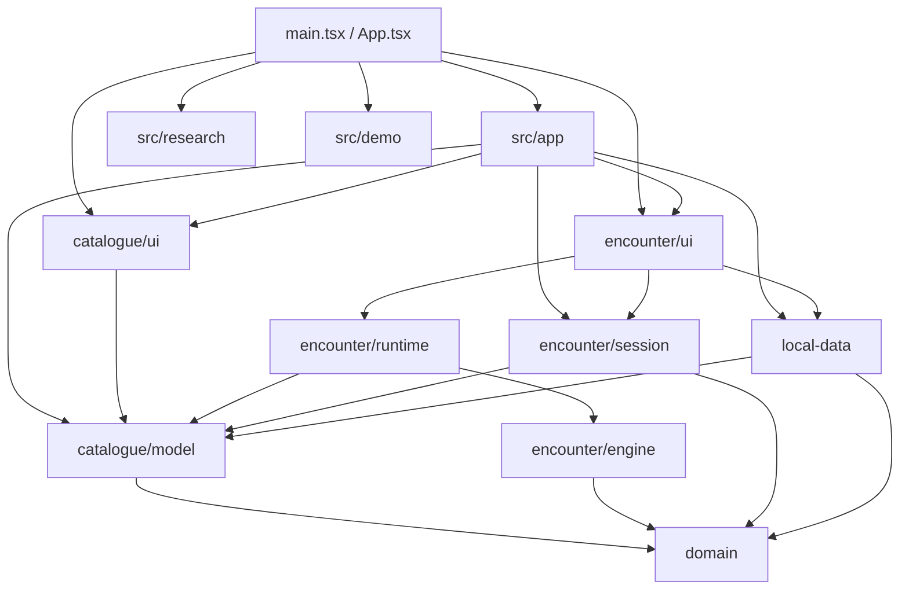
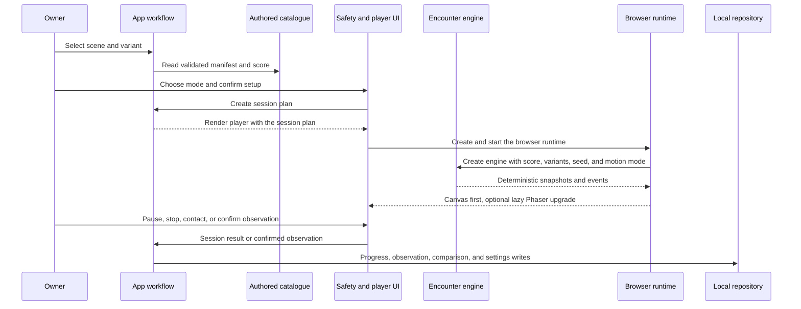

# How Catflix is built

This document is for developers and reviewers who are new to the codebase,
including readers less familiar with IndexedDB (the browser's built-in
database), JavaScript bundling, or CI (continuous integration — automated
checks that run in GitHub).

## In brief

Catflix is a modular, local-first React app. One browser tab shows a
catalogue of five authored encounters, walks the owner through a safety
setup, runs a deterministic finite simulation, and keeps descriptive records
on the device. There's no backend, account, API, analytics, cloud sync, or
catalogue service to call. [ARCHITECTURE, Intro] The browser app is the only
runtime; IndexedDB and the bundled assets are its only local dependencies;
external research links are navigation targets, not data sources; and GitHub
Actions is the only deployment path. [ARCHITECTURE, System context]

Five ideas shape everything below:

1. **One browser app, nothing else.** No server, account, API, analytics
   service, cloud sync, or catalogue network dependency exists to call.
2. **Strict, one-directional module boundaries, checked by a script — not
   just by convention.** A dependency cycle (modules importing each other in
   a loop) or a forbidden import direction would violate these boundaries.
3. **A deterministic simulation engine, decoupled from rendering.** The
   engine produces the same output from the same input every time; Canvas
   (the browser's 2D drawing surface) renders first, with an optional,
   lazily loaded Phaser upgrade.
4. **One persistence module owning a single, versioned local database**, with
   atomic writes and hard capacity limits.
5. **A pipeline that builds once, then reuses the same output** for GitHub
   Pages deployment.

## The parts and how they depend on each other

Each folder under `src/` owns one responsibility, and the table below states
that responsibility plus what may or may not depend on it. [ARCHITECTURE,
Components]

| Component | Responsibility | Boundary |
| --- | --- | --- |
| `src/domain/` | Stable scene, variant, playback, setup, and simulation contracts | Pure lowest-level vocabulary; imports no product module |
| `src/catalogue/model/` | Five authored scene aggregates, validation, provenance, manifests, and scene-score projections | Pure content source of truth; depends on `domain` |
| `src/encounter/engine/` | Seeded actor state, timing, motion, contact policy, rest windows, events, and completion | Pure simulation; depends on `domain` |
| `src/encounter/session.ts` | Converts a selected manifest and setup into a session plan | Depends on `domain` and catalogue model |
| `src/encounter/runtime/` | Browser lifecycle, Canvas renderer, lazy Phaser renderer, visibility, pointers, and synthesized Web Audio playback | Browser adapter over the engine and catalogue runtime inputs |
| `src/encounter/ui/` | Safety gate, player shell, owner controls, curator, and observation forms | React presentation and encounter orchestration |
| `src/local-data/` | Versioned records, validation, IndexedDB, degraded memory, import/export, and repository operations | Only persistence boundary |
| `src/catalogue/ui/` | Catalogue, filters, queue, evidence summaries, and local-data controls | Renders supplied application state; owns no workflow or persistence |
| `src/research/` | `/research` route and safe Markdown presentation | Loads the maintained research Markdown at build time |
| `src/demo/` | `/demo` screenshot tour of the shipped surfaces | Reads checked-in screenshots and `paths`; owns no product rules |
| `src/ui/`, `src/styles/` | Shared presentation primitives and global/feature CSS | No product rules |
| `src/app/`, `src/App.tsx`, `src/main.tsx` | Workflow state, module composition, route selection, and lazy screen loading | Application integration only |

A few terms worth defining before the table above makes full sense: a
**module boundary** is the rule that one kind of code lives in exactly one
part of the codebase (for example, only `src/local-data/` may talk to
IndexedDB). **Import direction** is the rule for which modules may import
which other modules — here, always toward `domain` at the bottom, never away
from it. A **dependency cycle** is a chain of imports that loops back on
itself (module A imports B, and B imports A); the codebase must have none.

The principal import direction — copied unchanged from the source, and kept
byte-for-byte identical because it is machine-checked in the repository:

The diagram shows the main edges, not every allowed UI import. [ARCHITECTURE,
Components] The diagram summarizes the intended import direction for a
reader; the component table describes each module's responsibility.

## What happens during an encounter

The sequence below — also copied unchanged from the source — traces one
playback session from the owner's first click to the records it leaves
behind:

The authored scene aggregate — the content record behind one scene — is the
single content source. It projects to a validated public manifest and a
deterministic scene score. [ARCHITECTURE, Encounter flow] The engine owns
simulation truth: Canvas and Phaser render the very same snapshots that the
engine computes, rather than each keeping their own version of what's
happening. Canvas starts synchronously (immediately, without waiting on
anything else to load) and stays the fallback renderer if Phaser can't load.
Passive television mode rejects contact input in both the runtime and the
engine — that is, even if a touch event somehow reached the code, both
layers refuse to act on it.

Progress callbacks already carry the computed phase, so the player keeps
precise elapsed time in a ref — a React value that can change without
triggering a re-render — and updates React's own state only when the
displayed second or phase actually changes. This keeps frequent internal
timing updates from causing frequent, unnecessary re-renders. Pausing cancels
Canvas scheduling outright; an explicit resume starts one loop from a fresh
time baseline rather than picking up a stale one. Phaser can finish loading
while playback is paused, and stays paused when it does. A visible tab never
resumes playback automatically — bringing the tab back into view is not
itself a reason to start playing again.

Sessions are finite by design. Three accepted target contacts within 20
seconds open a 10-to-12-second quiet rest window: a short, automatic pause
built into the simulation itself, not a UI-only effect. Contact responses
never add speed, actors, sound, contrast, or duration — touching the scene
cannot escalate it. Playback begins muted, and only the owner's explicit
gesture enables Web Audio (the browser API used for in-page sound); each
event then synthesizes quiet, source-coherent sound — sound that seems to
come from the thing making it on screen — rather than loading a pre-recorded
sound file.

## How local data works

`src/local-data/` is the only module allowed to own persistence, and it owns
one thing: the browser's IndexedDB database, named `catflix-local`, at
schema version 2 (the current shape of its stores), with seven stores
(named collections of records, comparable to tables): `settings`, `queue`,
`progress`, `notes`, `observations`, `comparisons`, and `provenance`. The
application's composition layer creates this repository once.
[ARCHITECTURE, Local data]

**Import and export.** Export always emits schema v2. Import accepts both
schema v1 and v2, and before writing anything it validates record shape,
bounded store and text sizes, unique keys, and linked-record consistency; it
also normalizes v1 settings to the current shape and supplies an empty
observations store for v1 data, which predates that store. The app first
prepares a metadata and count preview so the owner can see what an import
would do; only an explicit confirmation replaces all seven stores, and it
does so in one transaction — one all-or-nothing database operation, so the
replacement either completes for every store or leaves the existing data
untouched. If IndexedDB can't open at all, the adapter reports degraded mode
and falls back to memory that only lasts for the life of the page; import and
export are disabled in that state, specifically so temporary data can never
be mistaken for durable, saved data.

**Safe writes.** After any record mutation, the repository returns a
`LocalRecordHistory` value, so the React state shown to the owner reflects
the actual committed notes, observations, and comparisons — not a count that
was merely incremented and could drift out of sync with what was really
saved. The transaction adapter stages a per-store log of key changes and
commits only the final `put` or `delete` operations that result; full-store
clears and wholesale replacement are reserved for imports alone, never for
ordinary edits. Capacity admission — the check that confirms a write won't
exceed a store's limit — reads a snapshot inside that same all-store,
read-write transaction, so if two browser tabs are open at once, their
capacity checks are serialized (forced to happen one at a time, in order)
rather than racing each other. Startup provenance is admitted as one batch.
Observation save and compatible-comparison creation share one multi-store
transaction, and so does exact note, observation, and comparison deletion.
Deleting an observation removes its links from any comparisons that still
reference it, and writes only the comparisons whose links actually changed;
deleting a comparison, in turn, keeps both of the observations it had linked.

**Capacity limits.** `localDataCapacity.ts` centralizes one byte limit and a
set of per-store count limits: a 5 MiB total, and at most one settings
record, five queue items, five progress records, 10,000 each of notes,
observations, and comparisons, and 100 provenance records. (A MiB, or
mebibyte, is about 1.05 MB — see the glossary.) Byte size is measured in
UTF-8 using the very same pretty-printed schema-v2 serialization that
downloads use, so the number checked against the limit is the same number a
downloaded file would show. Both the size of an uploaded import file and the
size of the normalized v1-or-v2 export are checked this way. A pair of
records — for example, an observation and the comparison it would create —
that together would exceed capacity is rejected atomically: either both are
refused before either is written, never one committed and the other refused.

**Recovery.** Capacity errors are their own typed kind of error, and they do
not signal a degraded (broken) IndexedDB — a rejected write because a limit
was reached is a different situation from a database that failed to open,
and the app is careful to tell them apart. When a write is rejected for
capacity, any open observation draft stays open rather than being discarded,
and a background persistence failure raises an application alert rather than
failing silently. Existing data that is already over a limit is never
truncated to fit: deletion and non-growing updates to that data remain
allowed, only further growth (new additions) is blocked. A normal export
still passes the normal import validation. A separate, explicit recovery
export exists for the oversized case: it preserves the oversized data under
a distinctly named file, with a notice that the file exceeds the normal
import limits. No recovery path shortens or drops data to make it fit.

**Pairing.** Earlier progress is treated only as a restart reminder, never as
a point to resume playback from partway through. Contrast and motion
observations pair into an A/B comparison only when the canonical A/B variants
match, and the scene, content revision, seed (the starting number that makes
a deterministic run reproducible), authored score, and comparison dimension
all agree as well. When a pair is found, pairing always picks the oldest
unused compatible observation, and it never overwrites one side of an
existing pair or infers which side "won." Imported historical records may
still carry older sound or novelty comparison dimensions, kept only for
schema compatibility; those older dimensions are display-only and play no
part in automatic pairing today.

## Pages and URL options

`src/main.tsx` selects one of three routes: the catalogue route `/`, the
lazily loaded research route `/research`, or the lazily loaded `/demo`
screenshot tour. `src/paths.ts` resolves each route's public paths against
Vite's base URL — including the deployed `/catflix/` prefix GitHub Pages
uses — so a path is never assumed to start from the site root.
[ARCHITECTURE, Routes and runtime controls]

Three query-string controls are supported:

- `seed=<positive-integer>` — a positive whole number that makes encounter
  selection deterministic (the same seed always selects the same encounter).
- `contrast=enhanced` — starts the enhanced figure-ground (subject-versus-
  background) variant.
- `renderer=canvas` — keeps the Canvas renderer instead of upgrading to
  Phaser.

Any other value for `renderer` falls back to the normal path: Canvas first,
with a lazy Phaser upgrade.

## Build and deployment

The repository is one private npm package. `npm run build` type-checks the
application and runs the Vite production build. [ARCHITECTURE, Build and deployment]

Vite (the project's build tool) emits `.vite/manifest.json` — a generated
listing of which built files depend on which. Phaser, the optional rendering
library, remains reachable through a dynamic import, loaded when needed.

`npm run build:pages` builds the app with the base path `/catflix/`, copies
`index.html` to `404.html` so client-side routing still works after a direct
link or refresh (history fallback), creates a `.nojekyll` file so GitHub
Pages serves the build as-is. GitHub Actions builds this artifact on pull
requests and pushes to `main`. The `deploy` job downloads the same artifact
and deploys it, but only on a push to
`main`, using OIDC (OpenID Connect — a way for the job to prove its identity
to GitHub Pages without a stored long-lived secret) for its Pages permissions.

## Rules for changes

- Add scene metadata, asset provenance, or authored runtime inputs only in
  `src/catalogue/model/`.
- Add simulation behavior only in `src/encounter/engine/`; renderers must not
  become a second encounter model.
- Add storage schemas, migration, validation, or browser persistence only in
  `src/local-data/`.
- Keep cross-module workflow in `src/app/`, and keep feature UI with its
  owning module.
- Use `src/ui/` only for primitives with more than one product consumer.
  Don't add generic helper directories or compatibility facades.

[ARCHITECTURE, Change rules] The modular-monolith shape — many internal
modules, but still one deployed application — is deliberate. All state and
rendering belong to one browser app, so a services layer or
dependency-injection container would invent a boundary that doesn't exist yet,
instead of isolating a real one.

## Glossary

- **Artifact (CI sense).** The build output one CI job produces and hands,
  unrebuilt, to a later job — here, the Pages build used by `deploy`.
- **Atomic / transaction.** A transaction is a group of database operations
  that either all succeed together or all fail together. An operation
  described as atomic can't be left half-done partway through.
- **Bundle / manifest.** A *bundle* is the JavaScript a browser downloads to
  run the app. A *manifest* lists generated files and their dependencies.
- **Canvas.** The browser's built-in 2D drawing surface; the renderer Catflix
  starts with, before any optional upgrade.
- **CI (continuous integration).** The automated checks GitHub runs on every
  push and pull request.
- **Capacity admission.** The check that runs inside a write transaction to
  confirm a new or changed record won't push a store over its size or count
  limit, before the write is allowed to commit.
- **Degraded mode.** The fallback used when IndexedDB can't open: data lives
  only in memory for the life of the page, and import/export are disabled so
  temporary data can't be mistaken for durable, saved data.
- **Deterministic.** Always producing the same output from the same input —
  used here of the encounter engine and, together with a seed, of encounter
  selection.
- **GitHub Pages.** The static-site hosting GitHub provides directly from a
  repository; this project deploys to it at base path `/catflix/`.
- **Import direction.** The rule for which modules may import which other
  modules; here, always toward `domain`, never away from it.
- **IndexedDB.** The browser's built-in database for storing structured data
  on the user's own device; Catflix's only persistence mechanism.
- **KiB / MiB.** Kibibyte and mebibyte, the binary units behind "kilobyte"
  and "megabyte." 1 MiB is about 1.05 MB, and 1 KiB is about 1.02 kB.
- **Module boundary.** The rule that one kind of code — persistence,
  simulation, rendering, and so on — lives in exactly one part of the
  codebase.
- **OIDC (OpenID Connect).** A way for a CI job to prove its identity to a
  deployment target — here, GitHub Pages — without a stored long-lived
  secret.
- **Phaser.** The optional, lazily loaded rendering library Catflix can
  upgrade to after Canvas has already started.
- **Recovery export.** An explicit, separately named download of data that
  is already over the normal import limits, preserved rather than dropped,
  even though it can't be re-imported the normal way.
- **Schema v1 / v2.** Version 1 and version 2 of the shape — fields and
  stores — that stored data follows. Import accepts both; export always
  emits v2.
- **Seed.** A starting number fed into a deterministic process so it
  produces a specific, reproducible result.
- **Store.** One named collection of records inside an IndexedDB database,
  comparable to a table. `catflix-local` has seven: `settings`, `queue`,
  `progress`, `notes`, `observations`, `comparisons`, and `provenance`.
- **Vite.** The project's build tool and development server.
