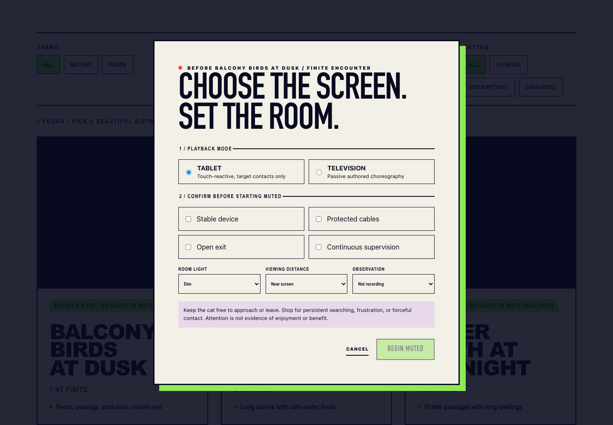
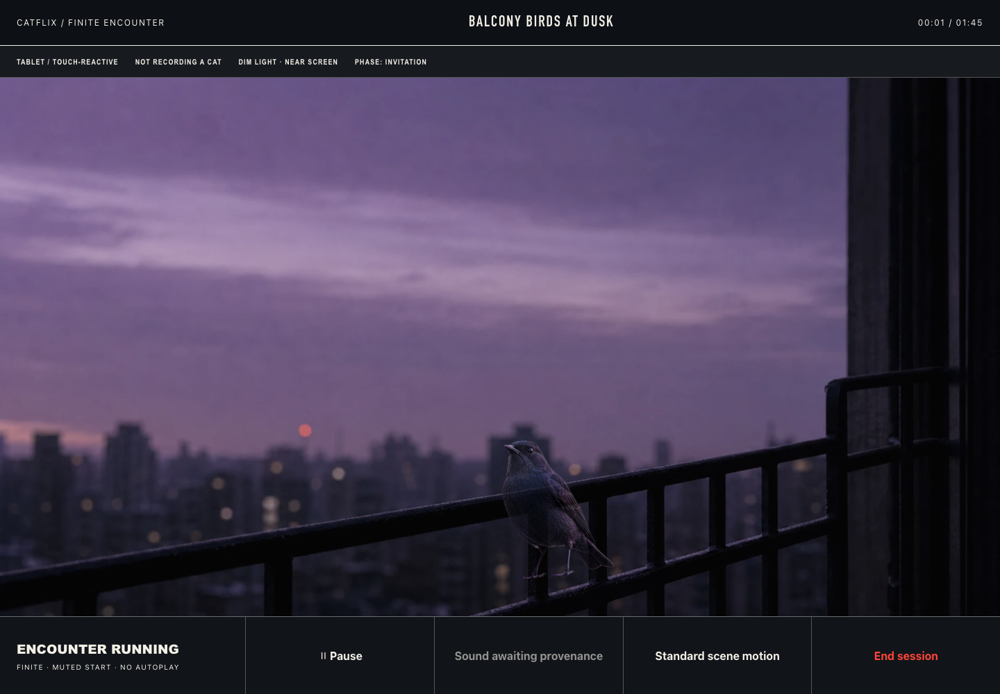
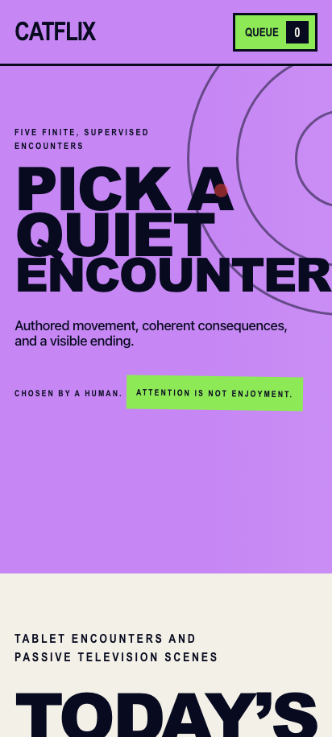

# Screenshots

These images are generated from the local application, not design mockups. The capture uses Chromium, a fixed scene seed of `7319`, English locale, light color scheme, reduced-motion rendering, and repository assets.

## Catalogue

The catalogue exposes five finite encounters, explicit filters, local queue actions, research summaries, and owner-controlled continuation.

## Safety gate

Playback remains unavailable until the viewer selects a screen context and confirms device stability, protected cables, an open exit, and continuous supervision.

## Tablet scene

The player keeps owner controls outside the scene, starts muted, exposes a scene-motion setting, and provides pause and end-session actions.

## Mobile catalogue

The primary catalogue remains available at a 412 by 915 pixel viewport without substituting a separate mobile application.

## Regenerate

The checked-in images are documentation assets. They are not produced or verified by browser automation.
